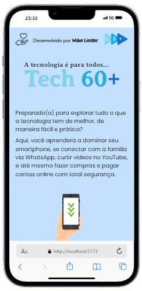

# Tech 60+
Visite https://tech60.vercel.app/

Este blog tem o objetivo de incluir e incentivar o público idoso a usar a tecnologia a seu favor.
Um blog especialmente criado para ajudar pessoas idosas a navegar pelo mundo da tecnologia com confiança e facilidade. Aqui você encontrará tutoriais passo a passo, dicas simples e acessíveis sobre smartphones, redes sociais, aplicativos, segurança digital e muito mais. Nosso objetivo é tornar a tecnologia acessível para todos, com uma linguagem clara e exemplos práticos, sempre respeitando o ritmo de cada um. Não importa sua experiência, sempre há algo novo para aprender! Conecte-se ao futuro com confiança e descubra como a tecnologia pode melhorar o seu dia a dia.

 

  

